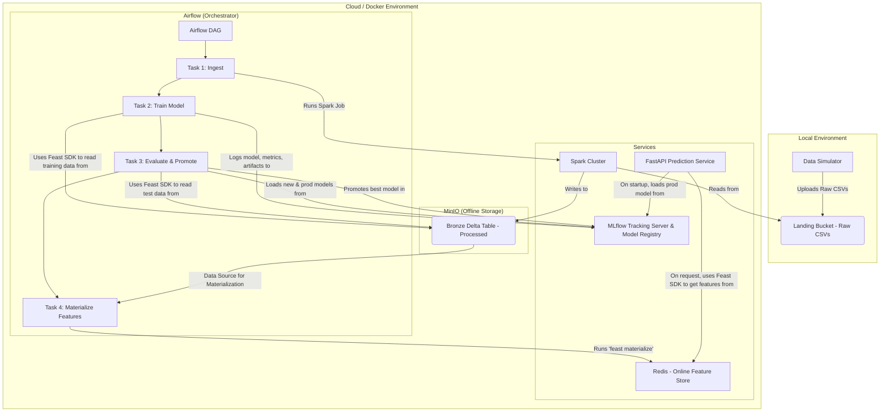

```mermaid
graph TD
    subgraph "Local Environment"
        A[Data Simulator] -->|Uploads Raw CSVs| B;
    end

    subgraph "Cloud / Docker Environment"
        subgraph "MinIO (Offline Storage)"
            B(Landing Bucket - Raw CSVs);
            C(Bronze Delta Table - Processed);
        end

        subgraph "Airflow (Orchestrator)"
            D[Airflow DAG] --> E[Task 1: Ingest];
            E --> F[Task 2: Train Model];
            F --> G[Task 3: Evaluate & Promote];
            G --> H[Task 4: Materialize Features];
        end

        subgraph "Services"
            I[Spark Cluster];
            J[MLflow Tracking Server & Model Registry];
            K[Redis - Online Feature Store];
            L[FastAPI Prediction Service];
        end
    end

    %% --- Data & Control Flow ---
    E -- Runs Spark Job --> I;
    I -- Reads from --> B;
    I -- Writes to --> C;

    F -- Uses Feast SDK to read training data from --> C;
    F -- Logs model, metrics, artifacts to --> J;

    G -- Loads new & prod models from --> J;
    G -- Uses Feast SDK to read test data from --> C;
    G -- Promotes best model in --> J;

    H -- Runs 'feast materialize' --> K;
    C -- Data Source for Materialization --> H;

    L -- On startup, loads prod model from --> J;
    L -- On request, uses Feast SDK to get features from --> K;
```