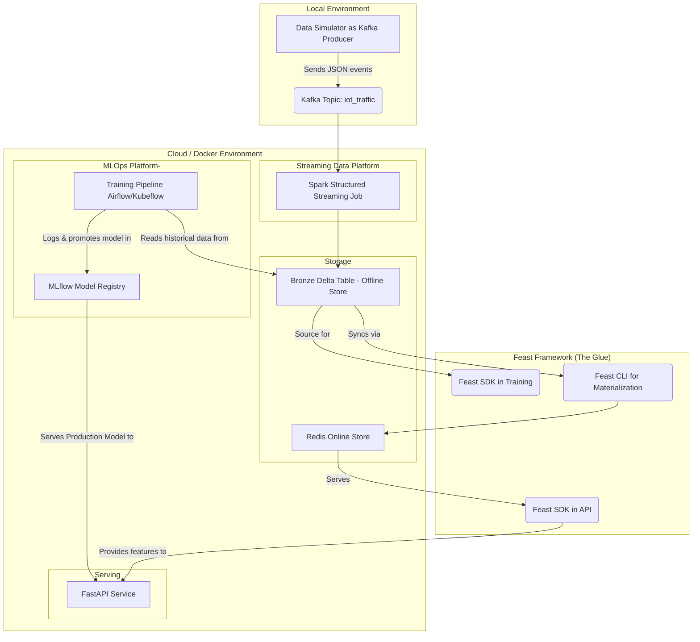

```mermaid
graph TD
    subgraph "Local Environment"
        A[Data Simulator as Kafka Producer] -->|Sends JSON events| B;
    end

    subgraph "Cloud / Docker Environment"
        subgraph "Streaming Data Platform"
            B(Kafka Topic: iot_traffic);
            C[Spark Structured Streaming Job];
        end
        
        subgraph "Storage"
            D[Bronze Delta Table - Offline Store];
            G[Redis Online Store];
        end

        subgraph "MLOps Platform"- 
            I[Training Pipeline Airflow/Kubeflow];
            J[MLflow Model Registry];
        end

        subgraph "Serving"
            H[FastAPI Service];
        end
    end

    %% --- Data & Control Flow ---
    B --> C;
    C --> D;

    I -- Reads historical data from --> D;
    I -- Logs & promotes model in --> J;
    
    subgraph "Feast Framework (The Glue)"
        Feast_SDK1(Feast SDK in Training);
        Feast_SDK2(Feast SDK in API);
        Feast_CLI(Feast CLI for Materialization);
    end
    
    D -- Source for --> Feast_SDK1;
    G -- Serves --> Feast_SDK2;
    D -- Syncs via --> Feast_CLI;
    Feast_CLI --> G;

    J -- Serves Production Model to --> H;
    Feast_SDK2 -- Provides features to --> H;
```