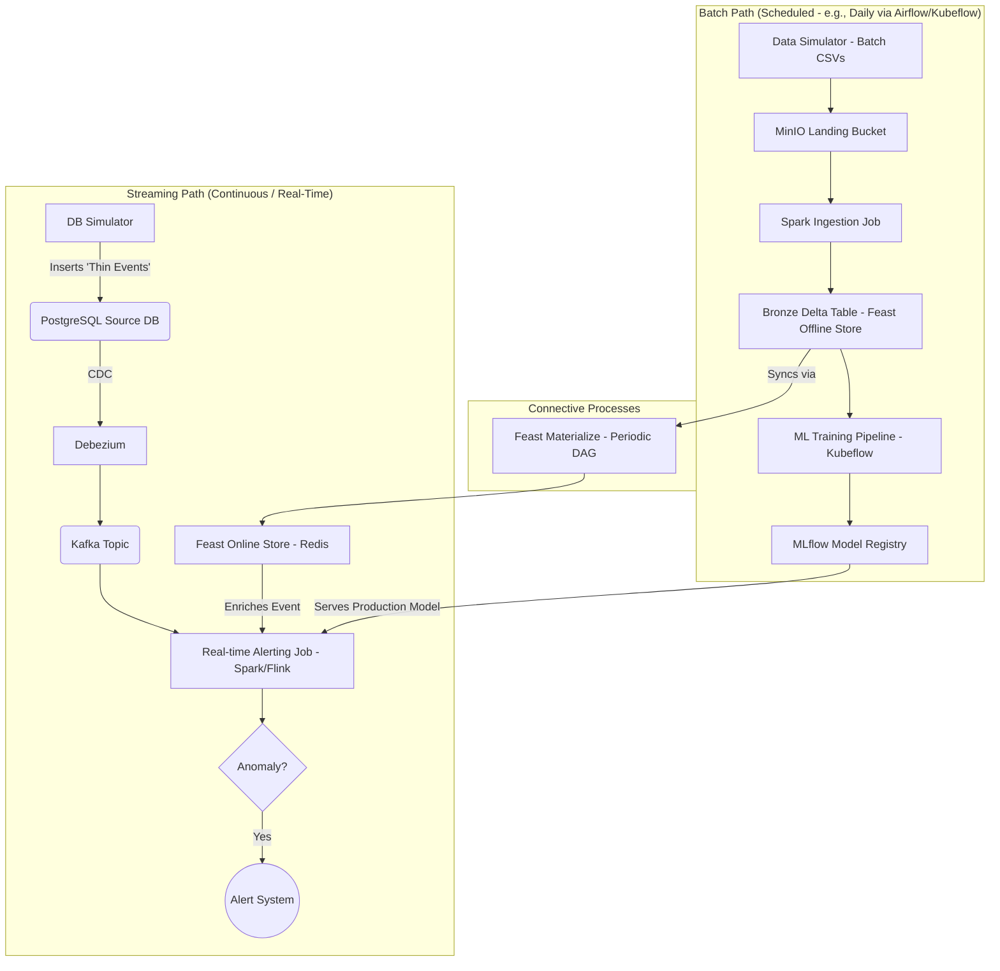

```mermaid
graph TD
    subgraph "Batch Path (Scheduled - e.g., Daily via Airflow/Kubeflow)"
        A[Data Simulator - Batch CSVs] --> B[MinIO Landing Bucket];
        B --> C[Spark Ingestion Job];
        C --> D[Bronze Delta Table - Feast Offline Store];
        D --> E[ML Training Pipeline - Kubeflow];
        E --> F[MLflow Model Registry];
    end

    subgraph "Streaming Path (Continuous / Real-Time)"
        G[DB Simulator] -->|Inserts 'Thin Events'| H(PostgreSQL Source DB);
        H --CDC--> I[Debezium];
        I --> J(Kafka Topic);
        J --> K[Real-time Alerting Job - Spark/Flink];
        L[Feast Online Store - Redis] --Enriches Event--> K;
        K --> M{Anomaly?};
        M --Yes--> N((Alert System));
    end

    %% --- How They Connect ---
    subgraph "Connective Processes"
        D --Syncs via--> O[Feast Materialize - Periodic DAG];
        O --> L;
        F --Serves Production Model--> K;
    end
```